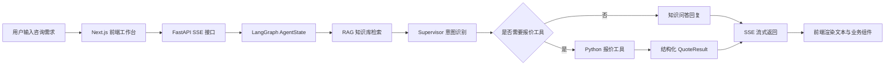

# B2B 工业智能售前与报价 Agent

一个面向 B2B 工业设备咨询场景的 AI Agent 项目。系统可以根据客户自然语言需求，完成产品知识检索、需求意图识别、报价参数抽取、报价工具调用，并通过流式回复和结构化组件输出售前方案、报价明细、推荐产品与参考资料。

项目目标不是做一个普通聊天机器人，而是把企业售前工作中的“问参数、选方案、估报价、留依据”串成一条可运行的 AI Agent 主链路。

## 在线体验

- 前端地址：https://b2b-industrial-sales-agent-27oy.vercel.app
- 后端接口文档：https://b2b-industrial-sales-agent-api.onrender.com/docs
- GitHub 仓库：https://github.com/zwm520996-dev/b2b-industrial-sales-agent

> 后端部署在 Render Free 实例。长时间无人访问后服务会休眠，首次请求可能需要 30-60 秒唤醒；第二次及后续请求会明显更快。

## 适用场景

该项目模拟工业设备企业的在线售前咨询流程，典型问题包括：

```text
500平中央空调多少钱？
中央空调多少钱？
化工厂耐高温阀门有什么参数要求？
这种阀门大概多少钱？
300平车间推荐什么空调方案？
```

系统会根据用户问题自动判断是知识问答、方案推荐，还是需要进入报价核算链路。

## 核心能力

- 多节点 Agent 编排：使用 LangGraph 将 RAG 检索、意图识别、工具调用、最终回复生成拆成独立节点。
- 企业知识库问答：使用 ChromaDB 存储工业产品资料，支持相似度检索，并返回参考来源。
- 报价工具调用：从用户对话中抽取设备类型和面积，调用 Python 工具完成报价核算。
- 多轮上下文理解：支持历史消息和摘要传递，例如先问“中央空调多少钱”，再补充“500平”，系统可以结合上下文继续报价。
- SSE 流式响应：后端通过 FastAPI StreamingResponse 推送文本、Agent 执行步骤、摘要和 UI 组件数据。
- 结构化前端渲染：前端根据后端返回的组件类型渲染报价表、推荐方案、参考资料和处理进度。
- 会话隔离与记录保留：通过 session_id 隔离会话，并在前端保留本地咨询记录；点击“清空记录”会生成新的会话。

## 技术栈

| 模块 | 技术 |
| --- | --- |
| 前端 | Next.js, React, TypeScript, Tailwind CSS |
| 后端 | FastAPI, LangGraph, Pydantic |
| 知识库 | ChromaDB |
| 模型调用 | SiliconFlow OpenAI-compatible API |
| 流式通信 | Server-Sent Events |
| 部署 | Vercel + Render |

## 系统架构



## Agent 执行链路

1. 用户在前端输入设备、面积、工况或报价需求。
2. 前端通过 `fetch` 请求后端 `/api/chat/stream`，并携带历史消息、摘要和 `session_id`。
3. 后端将用户输入写入 LangGraph 的共享状态 `AgentState`。
4. RAG 节点检索企业知识库，得到相关产品资料和参考来源。
5. Supervisor 节点结合用户问题、历史上下文和 RAG 结果识别意图。
6. 如果信息足够且需要报价，进入工具调用节点，完成设备类型、面积和总价核算。
7. 最终回复节点组织面向客户的售前话术，并输出结构化 UI 数据。
8. 前端按 SSE 数据类型分别渲染文本、执行步骤、报价表、推荐产品和参考资料。

## 工程亮点

### 1. LangGraph 状态机编排

项目将 Agent 拆分为多个职责清晰的节点，而不是把所有逻辑写在一个大函数里。这样便于展示 Agent 的执行过程，也便于后续扩展更多节点，例如权限判断、CRM 写入、人工转接等。

### 2. RAG 与结构化来源展示

知识库不仅用于给模型补充上下文，也会把检索到的资料来源返回给前端。用户可以看到推荐或回答依据，避免结果像“黑盒回答”。

### 3. 工具调用报价链路

报价不是完全依赖大模型生成，而是由 Agent 识别意图后调用确定性的 Python 工具完成核算。这样更符合企业业务系统中“模型负责理解，工具负责计算”的设计思路。

### 4. SSE 多类型事件流

后端通过同一条 SSE 通道返回多种事件：

- `text`：大模型生成的回复文本
- `agent_step`：Agent 执行过程
- `summary`：长历史压缩摘要
- `ui_component`：结构化组件数据

前端根据事件类型分别更新聊天内容和业务组件，实现文本与结构化结果同步输出。

### 5. 长历史压缩与会话隔离

项目通过 `session_id` 区分不同咨询会话，并在多轮对话后生成摘要，避免历史消息无限增长。前端也支持刷新保留记录和清空记录，清空时会生成新的会话 ID，避免旧上下文串到新咨询中。

## 本地运行

### 后端

```bash
cd backend
pip install -r requirements.txt
uvicorn main:app --reload
```

### 前端

```bash
cd frontend
npm install
npm run dev
```

### 环境变量

后端 `backend/.env`：

```bash
SILICONFLOW_API_KEY=your_siliconflow_api_key
ALLOWED_ORIGINS=http://localhost:3000
```

前端 `frontend/.env`：

```bash
NEXT_PUBLIC_API_BASE_URL=http://127.0.0.1:8000
```

## 部署说明

- 前端部署在 Vercel，Root Directory 设置为 `frontend`
- 后端部署在 Render，Root Directory 设置为 `backend`
- 后端启动命令：`uvicorn main:app --host 0.0.0.0 --port $PORT`
- 线上环境变量分别在 Vercel 和 Render 控制台配置
- `.env` 文件不会提交到 GitHub，只提交 `.env.example`
