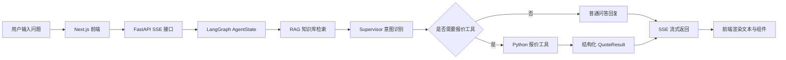

# B2B 工业智能售前与报价 Agent

一个面向 B2B 工业设备场景的 AI Agent 演示项目。用户可以用自然语言咨询设备参数、方案推荐和工程报价，系统会通过 RAG 检索企业知识库、识别用户意图、调用报价工具，并以流式回复和结构化 UI 组件展示结果。

## 在线演示

- 前端演示：https://b2b-industrial-sales-agent-27oy.vercel.app
- 后端接口文档：https://b2b-industrial-sales-agent-api.onrender.com/docs

> 说明：后端部署在 Render Free 实例，长时间无人访问后会休眠，首次请求可能需要 30-60 秒唤醒。

## 核心亮点

- LangGraph 多节点 Agent 编排：RAG 检索、意图识别、工具调用、最终响应生成分节点执行。
- RAG 企业知识库问答：基于 ChromaDB 存储工业产品资料，并返回参考来源与相似度分数。
- 工具调用报价链路：从用户对话中抽取设备类型和面积，调用 Python 工具完成报价核算。
- SSE 流式响应：后端通过 FastAPI StreamingResponse 推送文本、执行步骤和 UI 组件数据。
- 结构化组件渲染：前端根据后端返回的 QuoteResult、ProductGallery、SourceList 渲染报价表、推荐方案和参考资料。
- 长历史压缩与会话隔离：支持 session_id 区分用户会话，并在多轮对话后压缩历史摘要，降低上下文成本。

## 技术栈

- Frontend：Next.js、React、TypeScript、Tailwind CSS
- Backend：FastAPI、LangGraph、ChromaDB、Pydantic
- LLM API：SiliconFlow OpenAI-compatible API
- Streaming：Server-Sent Events
- Deploy：Vercel + Render

## 项目链路



## 推荐测试问题

```text
500平中央空调多少钱？
中央空调多少钱？
300平
化工厂耐高温阀门有什么参数要求？
这种阀门大概多少钱？
300平车间推荐什么空调方案？
```

## 本地运行

后端：

```bash
cd backend
pip install -r requirements.txt
uvicorn main:app --reload
```

前端：

```bash
cd frontend
npm install
npm run dev
```

环境变量示例：

```bash
# backend/.env
SILICONFLOW_API_KEY=your_siliconflow_api_key
ALLOWED_ORIGINS=http://localhost:3000

# frontend/.env
NEXT_PUBLIC_API_BASE_URL=http://127.0.0.1:8000
```

## 部署说明

- 前端部署在 Vercel，Root Directory 为 `frontend`
- 后端部署在 Render，Root Directory 为 `backend`
- 线上环境变量分别在 Vercel / Render 控制台配置
- `.env` 文件不会提交到 GitHub，只提交 `.env.example`